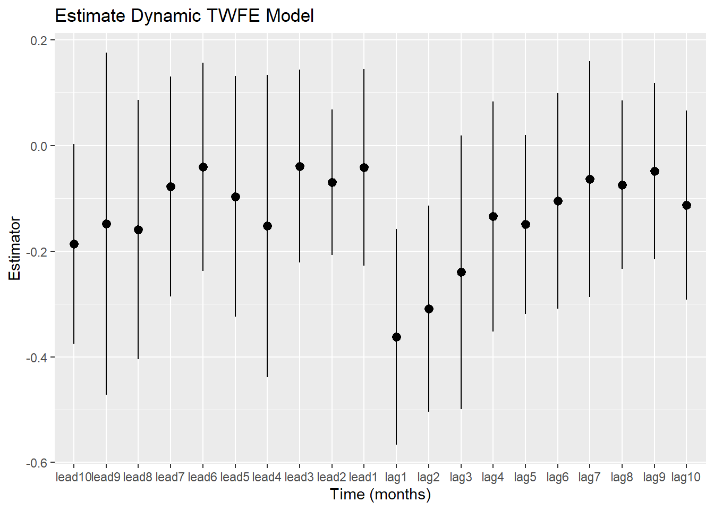
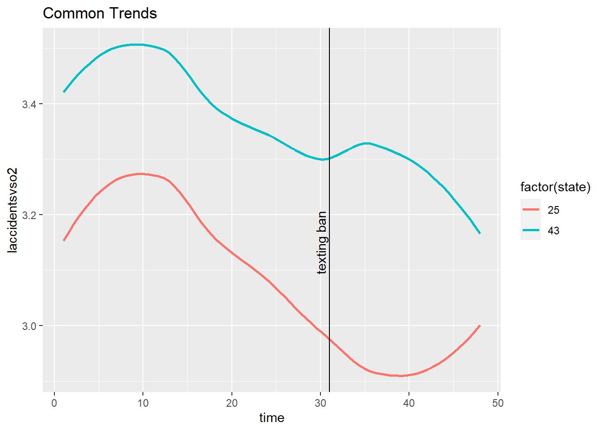
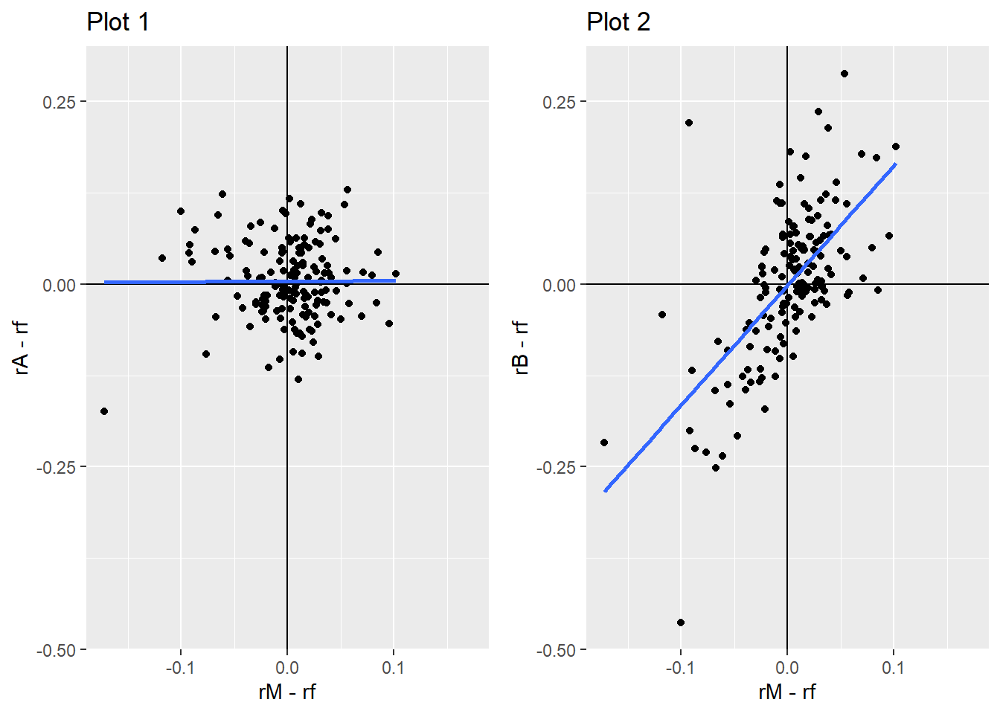

# Applied Econometrics: Four Ways to Measure Cause and Effect

Did X actually *cause* Y, or do they just move together? This project answers that question four times, each time with real data from a published study and a different tool from the econometrics toolkit: a field experiment, a randomized trial, regression, and difference-in-differences.



| Part | Question | Method | Key finding | Report |
|---|---|---|---|---|
| **1. [Ban the Box](01-ban-the-box)** | When employers can't ask about criminal records, do they discriminate by race instead? | **Field experiment:** ~15,000 fictitious job applications (Agan & Starr) | White applicants got called back **2.4 percentage points** more often than otherwise identical Black applicants (13% vs. 11%) | [View](https://idoshalom1997.github.io/Applied-Econometrics-Causal-Inference/ban_the_box.html) |
| **2. [Early childhood education](02-early-childhood-rct)** | Does high-quality preschool for children in poverty change their lives? | **Randomized controlled trial**, with randomization inference | **+7.3 IQ points** at age 5 (still +5.3 at 12), 29 percentage points fewer grade repetitions, 20 percentage points more college attendance, but no effect on crime | [View](https://idoshalom1997.github.io/Applied-Econometrics-Causal-Inference/early_childhood_rct.html) |
| **3. [Regression & the CAPM](03-capm-regression)** | How much does a stock move with the market, and does a fund beat it? | **OLS regression** with robust standard errors | Morgan Stanley's beta is **1.64** and gold's is **0.01**; the SWPPX fund earned a small but significant positive alpha (p = 0.02) | [View](https://idoshalom1997.github.io/Applied-Econometrics-Causal-Inference/capm_regression.html) |
| **4. [Texting bans](04-texting-bans-did)** | Did banning texting while driving reduce car accidents? | **Difference-in-differences**, two-way fixed effects and an event study (Abouk & Adams) | Accidents dropped in the first few months after a ban, then returned to normal: a **short-lived effect** | [View](https://idoshalom1997.github.io/Applied-Econometrics-Causal-Inference/texting_bans_did.html) |

## Highlights

<table>
<tr>
<td width="50%"><br><sub><b>Part 4:</b> before the ban, accidents in the treated state (43) and the control state (25) move in parallel, which is the key assumption behind difference-in-differences.</sub></td>
<td width="50%"><br><sub><b>Part 3:</b> gold shares (left) barely move with the market, while Morgan Stanley (right) amplifies it, so gold is the hedge for a risk-averse investor.</sub></td>
</tr>
</table>

## What each part covers

1. **Ban the Box:** the law of iterated expectations, fully saturated regressions and conditional means, and racial callback gaps with and without a criminal-record question, using interactions between race, record and the box.
2. **Early childhood education:** baseline balance, average treatment effects on 14 outcomes from IQ to employment and crime, and permutation-based p-values (randomization inference) to check the results without relying on regression assumptions.
3. **Regression & the CAPM:** deriving beta as a ratio of covariance to variance, estimating it for two stocks, testing a mutual fund's alpha, and heteroskedasticity-robust inference.
4. **Texting bans:** a two-state difference-in-differences with and without controls and population weights, a multi-state version with state and time fixed effects, and a dynamic event study with 10 leads and lags.

## How to run

Each part is a self-contained R Markdown file with its data in a `data/` folder next to it. You need R with these packages:

```r
install.packages(c("dplyr", "ggplot2", "estimatr", "gmodels", "gridExtra", "lmtest",
                   "psych", "readstata13", "sandwich", "stargazer", "rmarkdown"))
# The 'ri' package (randomization inference) is archived on CRAN:
install.packages("https://cran.r-project.org/src/contrib/Archive/ri/ri_0.9.tar.gz", repos = NULL, type = "source")

rmarkdown::render("04-texting-bans-did/texting_bans_did.Rmd")
```

## Authors

Group work by **Ido Shalom, Daniel Rodan, Ofri Ahiel and Ori Shneor**, as problem sets for *Applied Econometrics* at the Hebrew University of Jerusalem, spring 2023 (B.Sc. Statistics & Data Science).

## Data sources

- Agan, A. & Starr, S. (2018). *Ban the Box, Criminal Records, and Racial Discrimination: A Field Experiment.* Quarterly Journal of Economics.
- The Early Training Project, a randomized preschool intervention for children in poverty.
- Monthly stock, market and mutual-fund returns (provided by the course).
- Abouk, R. & Adams, S. (2013). *Texting Bans and Fatal Accidents on Roadways: Do They Work? Or Do Drivers Just React to Announcements of Bans?* American Economic Journal: Applied Economics.
